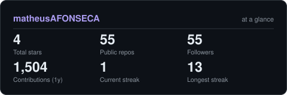

<picture>
  <source media="(prefers-color-scheme: dark)" srcset="assets/banner-dark.v9.svg">
  <source media="(prefers-color-scheme: light)" srcset="assets/banner-light.v9.svg">
  
</picture>

 

 

&nbsp;&nbsp;
&nbsp;&nbsp;

 

---

## This is me :)

Hi, I'm **Matheus Fonseca**, an **ML Developer and Full-stack Developer** from Brazil 🇧🇷, focused on building practical, scalable software and AI systems.

- 🤖 I work with **Machine Learning, Artificial Intelligence and Computer Vision**, especially Python-based AI solutions.
- 🎓 My **Master's research** focuses on AI and Computer Vision models, especially **model optimization, performance benchmarking and architecture comparison**.
- 🧠 My interests include **software development, Machine Learning, AI, model optimization and scalability**.
- 🛠️ I build backend and application solutions with **FastAPI, React, React Native and Docker**.
- ⚙️ I enjoy the full pipeline: **data preparation → training → evaluation → optimization → deployment**.
- 🌱 Currently deepening my knowledge in **LLMs, AI agents, MLOps and scalable software architectures**.
- 💬 Talk to me about **AI, Computer Vision, Python, APIs or research engineering**.

 

## my perfect stack

---

## signals

<table>
<tr>
<td width="50%" align="center" valign="middle">

<picture>
  <source media="(prefers-color-scheme: dark)" srcset="assets/radar-dark.svg">
  <source media="(prefers-color-scheme: light)" srcset="assets/radar-light.svg">
  
</picture>

</td>
<td width="50%" align="center" valign="middle">

<picture>
  <source media="(prefers-color-scheme: dark)" srcset="assets/radar-langs-dark.svg">
  <source media="(prefers-color-scheme: light)" srcset="assets/radar-langs-light.svg">
  
</picture>

</td>
</tr>
</table>

---

## Numbers matter? ohhh yes.

<picture>
  <source media="(prefers-color-scheme: dark)" srcset="assets/card-stats-dark.svg">
  <source media="(prefers-color-scheme: light)" srcset="assets/card-stats-light.svg">
  
</picture>

 

---

<i>Build · Research · Learn · Repeat.</i>

